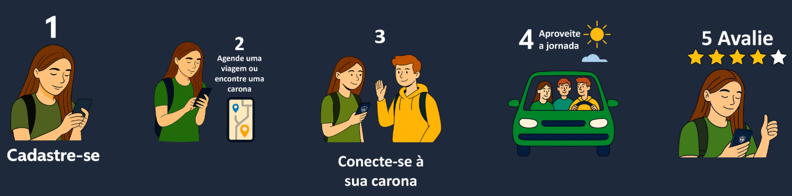

<div align="center">


# FaculRide — Mobile

**Aplicativo de caronas universitárias para a FATEC Votorantim**

Versão `0.7.0-preview.1` · React Native · Expo · TypeScript

</div>

---

## 📖 Sobre o Projeto

O **FaculRide Mobile** é a versão para dispositivos móveis da plataforma FaculRide — um sistema de caronas universitárias desenvolvido para conectar alunos motoristas e passageiros da FATEC Votorantim. O app permite oferecer ou procurar caronas com agendamento por calendário, negociação via chat integrado, avaliação pós-viagem e gerenciamento completo de perfil, incluindo upload de foto e CNH.

O aplicativo é integrado à infraestrutura AWS: backend em EC2, banco de dados PostgreSQL no RDS, armazenamento de imagens no S3 e metadados no MongoDB Atlas.

---

<div align="center">



</div>

---

## 🚀 Tecnologias Utilizadas

| Tecnologia | Versão | Uso |
|---|---|---|
| React Native | 0.81.5 | Framework mobile |
| Expo | ~54.0.33 | Plataforma de desenvolvimento |
| Expo Router | ~6.0.23 | Navegação file-based |
| TypeScript | ~5.9.2 | Tipagem estática |
| AsyncStorage | 2.2.0 | Persistência local de dados |
| Axios | ^1.13.6 | Requisições HTTP |
| React Native WebView | 13.15.0 | Mapas Leaflet embarcados |
| React Native Maps | 1.20.1 | Integração com mapas nativos |
| Expo Image Picker | ~17.0.10 | Upload de foto e CNH |
| Expo Document Picker | ~14.0.8 | Seleção de arquivos |
| DateTimePicker | 8.4.4 | Seleção de horários (iOS/Android) |
| React Native Reanimated | ~4.1.1 | Animações fluidas |
| React Native Gesture Handler | ~2.28.0 | Gestos e interações |

### ☁️ Infraestrutura (Backend/Cloud)

| Serviço | Uso |
|---|---|
| AWS EC2 | Servidor do backend (Node.js + Express) |
| AWS RDS (PostgreSQL) | Banco de dados principal |
| AWS S3 | Armazenamento de fotos de perfil e CNH |
| MongoDB Atlas | Índice de metadados das imagens no S3 |
| DuckDNS | DNS dinâmico para o backend (`faculride-api.duckdns.org`) |

---

## 📱 Telas do Aplicativo

### Autenticação
| Tela | Descrição |
|---|---|
| **Splash** | Tela de entrada com animação de carregamento |
| **Login** | Acesso com e-mail e senha |
| **Cadastro** | Registro como motorista ou passageiro, com upload de foto de perfil |

### Navegação Principal (Bottom Tabs)
| Tela | Ícone | Descrição |
|---|---|---|
| **Início** | 🗺️ | Mapa interativo com todas as caronas disponíveis, filtros por tipo e cidade |
| **Sua Carona** | 🚗 | Criar ou editar carona com calendário manual ou modo semestre |
| **Encontre** | 🔍 | Lista de caronas com mini-mapa de rota e ações de contato |
| **Contato** | 💬 | Chat em tempo real com motorista/passageiro para negociação de carona |
| **Atividades** | 📋 | Histórico de viagens e avaliações recebidas |
| **Conta** | 👤 | Perfil do usuário, atalhos e logout |

### Telas Extras
| Tela | Descrição |
|---|---|
| **Gerenciar Conta** | Editar dados pessoais, trocar foto, upload de CNH, gerenciar veículo |
| **Ajuda** | Central de suporte e perguntas frequentes |
| **Como Funciona** | Tutorial do fluxo completo do app |
| **Sobre** | Informações sobre o projeto |
| **Devs** | Créditos da equipe de desenvolvimento |

---

## ✅ Requisitos Funcionais

| ID | Nome | Descrição | Status |
|---|---|---|---|
| RF001 | Login | Autenticação com e-mail e senha via JWT | ✅ |
| RF002 | Cadastro | Registro como motorista ou passageiro com validações | ✅ |
| RF003 | Gerenciar Usuário | Consultar, alterar dados pessoais, senha e foto | ✅ |
| RF004 | Oferecer Carona | Motorista cadastra carona com origem, horários, datas e custo | ✅ |
| RF005 | Procurar Carona | Passageiro registra interesse em carona com mesmos dados | ✅ |
| RF006 | Visualizar Caronas | Mapa interativo e lista com filtros por tipo e cidade | ✅ |
| RF007 | Agendamento por Calendário | Seleção manual de dias ou preenchimento automático por semestre | ✅ |
| RF008 | Chat / Negociação | Troca de mensagens entre motorista e passageiro antes da confirmação | ✅ |
| RF009 | Aceitar / Recusar Carona | Ambos os lados confirmam ou recusam dentro do chat | ✅ |
| RF010 | Avaliação | Sistema de estrelas (1–5) com comentário pós-viagem | ✅ |
| RF011 | Upload de Foto de Perfil | Envio de foto da câmera ou galeria com armazenamento no S3 | ✅ |
| RF012 | Upload de CNH | Envio de foto da CNH para motoristas com armazenamento no S3 | ✅ |
| RF013 | Gerenciar Veículo | Cadastro e atualização de dados do veículo do motorista | ✅ |
| RF014 | Busca de CEP | Preenchimento automático de endereço via ViaCEP | ✅ |
| RF015 | Histórico de Atividades | Visualização de viagens e avaliações do usuário | ✅ |
| RF016 | Cancelar Carona | Motorista pode cancelar carona cadastrada | ✅ |

---

## 🚫 Requisitos Não Funcionais

| ID | Nome | Descrição |
|---|---|---|
| RNF001 | Banco de Dados | PostgreSQL no AWS RDS com Sequelize ORM |
| RNF002 | Framework Mobile | React Native com Expo e TypeScript |
| RNF003 | Segurança | Autenticação via JWT, senhas com bcrypt, rotas protegidas |
| RNF004 | Escalabilidade | Backend em EC2 com arquitetura RESTful escalável |
| RNF005 | Velocidade e Eficiência | Cache local de geocoding (TTL 30 dias) para reduzir chamadas de API |
| RNF006 | Disponibilidade | Backend disponível 24/7 via AWS EC2 com DuckDNS |
| RNF007 | Usabilidade | Interface com bottom tabs, modais e feedback visual em todas as ações |
| RNF008 | Confiabilidade | Tratamento de erros em todas as requisições com feedback ao usuário |
| RNF009 | Portabilidade | Compatível com Android e iOS via Expo |
| RNF010 | Manutenibilidade | Código organizado por telas com Expo Router (file-based routing) |
| RNF011 | Armazenamento de Imagens | Fotos de perfil e CNH armazenadas no AWS S3 (`faculride01`) |
| RNF012 | Persistência Local | AsyncStorage para token JWT e dados do usuário logado |
| RNF013 | Atualização de Chat | Polling automático a cada 3 segundos para simular tempo real |
| RNF014 | Tamanho Reduzido | App otimizado com lazy loading e dependências enxutas |

---

## 🗂️ Estrutura de Pastas

```
faculride-mobile/
├── app/
│   ├── (auth)/
│   │   ├── login.tsx          # Tela de login
│   │   └── cadastro.tsx       # Tela de cadastro
│   ├── (tabs)/
│   │   ├── _layout.tsx        # Configuração do bottom tab navigator
│   │   ├── index.tsx          # Home — mapa com caronas
│   │   ├── sua-carona.tsx     # Criar/editar carona
│   │   ├── encontre.tsx       # Buscar caronas em lista
│   │   ├── contato.tsx        # Chat e negociação
│   │   ├── atividades.tsx     # Histórico e avaliações
│   │   └── conta.tsx          # Perfil e atalhos
│   ├── _layout.tsx            # Layout raiz com SafeAreaView
│   ├── index.tsx              # Splash screen com animação
│   ├── gerenciar-conta.tsx    # Editar perfil, foto, CNH, veículo
│   ├── ajuda.tsx              # Central de ajuda
│   ├── como-funciona.tsx      # Tutorial do app
│   ├── sobre.tsx              # Sobre o projeto
│   └── devs.tsx               # Créditos da equipe
├── assets/
│   └── images/                # Imagens e ícones do app
├── package.json
└── tsconfig.json
```

---

## ⚙️ Como Rodar o Projeto

### Pré-requisitos
- Node.js instalado
- Expo CLI instalado (`npm install -g expo-cli`)
- Android Studio (emulador Android) ou Expo Go (celular físico)

### Instalação

```bash
# Clonar o repositório
git clone https://github.com/seu-usuario/faculride-mobile.git
cd faculride-mobile

# Instalar dependências
npm install
```

### Executar

```bash
# Iniciar o projeto
npx expo start

# Android
npx expo start --android

# iOS
npx expo start --ios
```

### Configurar a URL da API

No arquivo `constants/api.ts`, configure as URLs do backend:

```ts
export const API_URL  = __DEV__
  ? "http://localhost:3000/api"          // desenvolvimento
  : "https://faculride-api.duckdns.org/api";  // produção (AWS EC2)

export const API_BASE = __DEV__
  ? "http://localhost:3000"
  : "https://faculride-api.duckdns.org";
```

---

## 🔄 Fluxo Principal do App

```
Cadastro / Login
      ↓
Home — Mapa com todas as caronas disponíveis
      ↓
Usuário cria carona (Sua Carona) ou encontra uma (Encontre)
      ↓
Inicia conversa via Chat (Contato)
      ↓
Motorista e Passageiro aceitam a carona
      ↓
Viagem realizada
      ↓
Ambos avaliam com estrelas e comentário
```

---

## 👥 Equipe

| Nome | RA |
|---|---|
| Breno Jose Da Silva | 3011392413025 |
| Davy Oliveira Ribeiro | — |
| Gabriel Ribeiro Correa | 3011392413032 |
| Herivelton Henrique Gonçalves | 3011392413011 |
| Pedro Silva Martins | — |
| Ryan Carlo Negretti Pereira | — |

---

<div align="center">

Desenvolvido com 💙 para a **FATEC Votorantim** — Projeto Integrador Mobile

</div>
